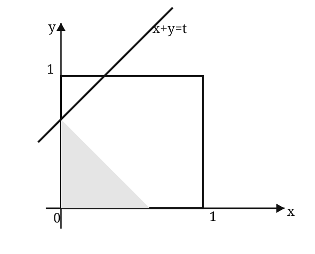

# 2000 年全国硕士研究生招生考试数学二真题

> 题面按用户提供的 1998–2007 历年真题合订 PDF 第 26–28 页逐题整理。第 12 题图形依据原卷示意复绘；若图形细节有疑义，以原卷扫描页为准。

## 一、填空题

### 第 1 题

$$
\lim_{x\to0}
\frac{\arctan x-x}{\ln(1+2x^3)}
=
\underline{\qquad\qquad}.
$$

### 第 2 题

设函数 $y=y(x)$ 由方程

$$
2^{xy}=x+y
$$

所确定，则

$$
\left.\mathrm dy\right|_{x=0}
=
\underline{\qquad\qquad}.
$$

### 第 3 题

$$
\int_2^{+\infty}
\frac{\mathrm dx}{(x+7)\sqrt{x-2}}
=
\underline{\qquad\qquad}.
$$

### 第 4 题

曲线

$$
y=(2x-1)e^{1/x}
$$

的斜渐近线方程为 ________。

### 第 5 题

设

$$
A=
\begin{pmatrix}
1&0&0&0\\
-2&3&0&0\\
0&-4&5&0\\
0&0&-6&7
\end{pmatrix},
$$

$E$ 为 $4$ 阶单位矩阵，且

$$
B=(E+A)^{-1}(E-A),
$$

则

$$
(E+B)^{-1}
=
\underline{\qquad\qquad}.
$$

## 二、选择题

### 第 6 题

设函数

$$
f(x)=\frac{x}{a+e^{bx}}
$$

在 $(-\infty,+\infty)$ 内连续，且

$$
\lim_{x\to-\infty}f(x)=0,
$$

则常数 $a,b$ 满足（ ）。

A. $a<0, b<0$

B. $a>0, b>0$

C. $a\le0, b>0$

D. $a\ge0, b<0$

### 第 7 题

设函数 $f(x)$ 满足关系式

$$
f''(x)+[f'(x)]^2=x,
\qquad
f'(0)=0,
$$

则（ ）。

A. $f(0)$ 是 $f(x)$ 的极大值

B. $f(0)$ 是 $f(x)$ 的极小值

C. 点 $(0,f(0))$ 是曲线 $y=f(x)$ 的拐点

D. $f(0)$ 不是 $f(x)$ 的极值，点 $(0,f(0))$ 也不是曲线 $y=f(x)$ 的拐点

### 第 8 题

设函数 $f(x),g(x)$ 是大于零的可导函数，且

$$
f'(x)g(x)-f(x)g'(x)<0,
$$

则当 $a<x<b$ 时，有（ ）。

A. $f(x)g(b)>f(b)g(x)$

B. $f(x)g(a)>f(a)g(x)$

C. $f(x)g(x)>f(b)g(b)$

D. $f(x)g(x)>f(a)g(a)$

### 第 9 题

若

$$
\lim_{x\to0}
\frac{\sin6x+xf(x)}{x^3}=0,
$$

则

$$
\lim_{x\to0}
\frac{6+f(x)}{x^2}
$$

为（ ）。

A. $0$

B. $6$

C. $36$

D. $\infty$

### 第 10 题

具有特解

$$
y_1=e^{-x},
\qquad
y_2=2xe^{-x},
\qquad
y_3=3e^x
$$

的 $3$ 阶常系数齐次线性微分方程是（ ）。

A. $y'''-y''-y'+y=0$

B. $y'''+y''-y'-y=0$

C. $y'''-6y''+11y'-6y=0$

D. $y'''-2y''-y'+2y=0$

## 三、解答题

### 第 11 题

设

$$
f(\ln x)=\frac{\ln(1+x)}x,
$$

计算

$$
\int f(x)\,\mathrm dx.
$$

### 第 12 题

设 $xOy$ 平面上有正方形

$$
D=\{(x,y)\mid0\le x\le1, 0\le y\le1\}
$$

及直线

$$
l:x+y=t\qquad(t\ge0).
$$

若 $S(t)$ 表示正方形 $D$ 位于直线 $l$ 左下方部分的面积，求

$$
\int_0^xS(t)\,\mathrm dt,
\qquad x\ge0.
$$

### 第 13 题

求函数

$$
f(x)=x^2\ln(1+x)
$$

在 $x=0$ 处的 $n$ 阶导数

$$
f^{(n)}(0),
\qquad n\ge3.
$$

### 第 14 题

设函数

$$
S(x)=\int_0^x|\cos t|\,\mathrm dt.
$$

（1）当 $n$ 为正整数，且

$$
n\pi\le x<(n+1)\pi
$$

时，证明

$$
2n\le S(x)<2(n+1);
$$

（2）求

$$
\lim_{x\to+\infty}\frac{S(x)}x.
$$

### 第 15 题

某湖泊的水量为 $V$，每年排入湖泊内含污染物 $A$ 的污水量为 $\dfrac V6$，流入湖泊内不含 $A$ 的水量为 $\dfrac V6$，流出湖泊的水量为 $\dfrac V3$。

已知 $1999$ 年年底湖中 $A$ 的含量为 $5m_0$，超过国家规定指标。为了治理污水，从 $2000$ 年年初起，限定排入湖泊中含 $A$ 污水的浓度不超过

$$
\frac{m_0}{V}.
$$

问至多需经过多少年，湖泊中污染物 $A$ 的含量将降至 $m_0$ 以内？（注：设湖水中 $A$ 的浓度是均匀的。）

### 第 16 题

设函数 $f(x)$ 在 $[0,\pi]$ 上连续，且

$$
\int_0^\pi f(x)\,\mathrm dx=0,
\qquad
\int_0^\pi f(x)\cos x\,\mathrm dx=0.
$$

试证明：在 $(0,\pi)$ 内至少存在两个不同的点 $\xi_1,\xi_2$，使

$$
f(\xi_1)=f(\xi_2)=0.
$$

### 第 17 题

已知 $f(x)$ 是周期为 $5$ 的连续函数，它在 $x=0$ 的某个邻域内满足关系式

$$
f(1+\sin x)-3f(1-\sin x)=8x+a(x),
$$

其中 $a(x)$ 是当 $x\to0$ 时比 $x$ 高阶的无穷小，且 $f(x)$ 在 $x=1$ 处可导。

求曲线 $y=f(x)$ 在点

$$
(6,f(6))
$$

处的切线方程。

### 第 18 题

设曲线

$$
y=ax^2
\qquad(a>0, x\ge0)
$$

与

$$
y=1-x^2
$$

交于点 $A$。过坐标原点 $O$ 和点 $A$ 的直线与曲线 $y=ax^2$ 围成一平面图形。

问 $a$ 为何值时，该图形绕 $x$ 轴旋转一周所得的旋转体体积最大？最大体积是多少？

### 第 19 题

函数 $f(x)$ 在 $(0,+\infty)$ 上可导，$f(0)=1$，且满足等式

$$
f'(x)+f(x)
-
\frac1{x+1}\int_0^x f(t)\,\mathrm dt
=0.
$$

（1）求导数 $f'(x)$；

（2）证明：当 $x\ge0$ 时，成立不等式

$$
e^{-x}\le f(x)\le1.
$$

### 第 20 题

设

$$
\alpha=
\begin{pmatrix}
1\\2\\1
\end{pmatrix},
\qquad
\beta=
\begin{pmatrix}
1\\[2pt]\dfrac12\\0
\end{pmatrix},
\qquad
\gamma=
\begin{pmatrix}
0\\0\\8
\end{pmatrix},
$$

$$
A=\alpha\beta^T,
\qquad
B=\beta^T\alpha,
$$

其中 $\beta^T$ 是 $\beta$ 的转置，求解方程

$$
2B^2A^2x=A^4x+B^4x+\gamma.
$$

### 第 21 题

已知向量组

$$
\beta_1=
\begin{pmatrix}
0\\1\\-1
\end{pmatrix},
\qquad
\beta_2=
\begin{pmatrix}
a\\2\\1
\end{pmatrix},
\qquad
\beta_3=
\begin{pmatrix}
b\\1\\0
\end{pmatrix}
$$

与向量组

$$
\alpha_1=
\begin{pmatrix}
1\\2\\-3
\end{pmatrix},
\qquad
\alpha_2=
\begin{pmatrix}
3\\0\\1
\end{pmatrix},
\qquad
\alpha_3=
\begin{pmatrix}
9\\6\\-7
\end{pmatrix}
$$

具有相同的秩，且 $\beta_3$ 可由 $\alpha_1,\alpha_2,\alpha_3$ 线性表示，求 $a,b$ 的值。
