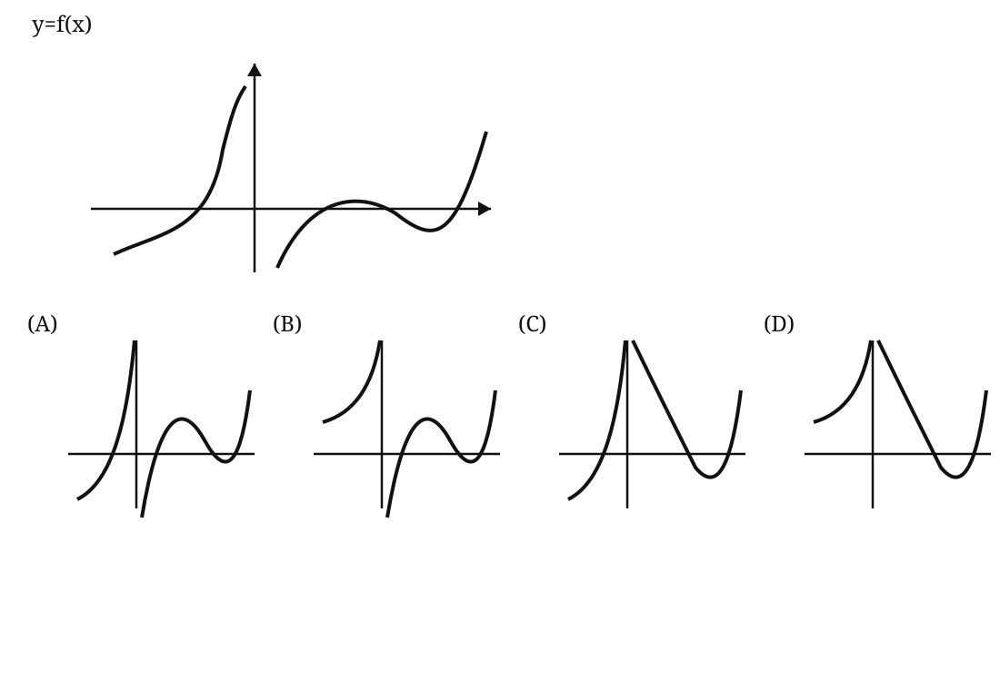

# 2001 年全国硕士研究生招生考试数学二真题

> 题面按用户提供的 1998–2007 历年真题合订 PDF 第 23–25 页逐题整理。选择题第 5 题图形依据原卷示意复绘；图形细节以原卷扫描页为准。

## 一、填空题

### 第 1 题

$$
\lim_{x\to1}
\frac{\sqrt{3-x}-\sqrt{1+x}}{x^2+x-2}
=
\text{________}.
$$

### 第 2 题

设函数 $y=f(x)$ 由方程

$$
e^{2x+y}-\cos(xy)=e-1
$$

所确定，则曲线 $y=f(x)$ 在点 $(0,1)$ 处的法线方程为 ________。

### 第 3 题

$$
\int_{-\pi/2}^{\pi/2}
(x^3+\sin^2x)\cos^2x\,\mathrm dx
=
\text{________}.
$$

### 第 4 题

过点 $\left(\dfrac12,0\right)$ 且满足关系式

$$
xy'\arcsin x+\frac{y}{\sqrt{1-x^2}}=1
$$

的曲线方程为 ________。

### 第 5 题

方程组

$$
\begin{pmatrix}
a&1&1\\
1&a&1\\
1&1&a
\end{pmatrix}
\begin{pmatrix}
x_1\\x_2\\x_3
\end{pmatrix}
=
\begin{pmatrix}
1\\1\\-2
\end{pmatrix}
$$

有无穷多解，则 $a=$ ________。

## 二、单项选择题

### 第 1 题

设

$$
f(x)=
\begin{cases}
1,&|x|\le1,\\
0,&|x|>1,
\end{cases}
$$

则

$$
f\{f[f(x)]\}
=
\text{（ ）}.
$$

A. $0$

B. $1$

C. $\displaystyle\begin{cases}1,&|x|\le1,\\0,&|x|>1\end{cases}$

D. $\displaystyle\begin{cases}0,&|x|\le1,\\1,&|x|>1\end{cases}$

### 第 2 题

设当 $x\to0$ 时，

$$
(1-\cos x)\ln(1+x^2)
$$

是比 $x\sin x^n$ 高阶的无穷小，而 $x\sin x^n$ 是比 $e^{x^2}-1$ 高阶的无穷小，则正整数 $n$ 等于（ ）。

A. $1$

B. $2$

C. $3$

D. $4$

### 第 3 题

曲线

$$
y=(x-1)^2(x-3)^2
$$

的拐点个数为（ ）。

A. $0$

B. $1$

C. $2$

D. $3$

### 第 4 题

已知函数 $f(x)$ 在区间 $(1-\delta,1+\delta)$ 内具有二阶导数，$f'(x)$ 严格单调减小，且

$$
f(1)=f'(1)=1,
$$

则（ ）。

A. 在 $(1-\delta,1)$ 和 $(1,1+\delta)$ 内均有 $f(x)<x$

B. 在 $(1-\delta,1)$ 和 $(1,1+\delta)$ 内均有 $f(x)>x$

C. 在 $(1-\delta,1)$ 内有 $f(x)<x$，在 $(1,1+\delta)$ 内有 $f(x)>x$

D. 在 $(1-\delta,1)$ 内有 $f(x)>x$，在 $(1,1+\delta)$ 内有 $f(x)<x$

### 第 5 题

已知函数 $y=f(x)$ 在其定义域内可导，它的图形如图所示，则其导函数 $y=f'(x)$ 的图形为（ ）。

## 三、解答题

### 第 3 题（6 分）

求不定积分

$$
\int\frac{\mathrm dx}{(2x^2+1)\sqrt{x^2+1}}.
$$

### 第 4 题（7 分）

求极限

$$
\lim_{t\to x}
\left(\frac{\sin t}{\sin x}\right)^{\frac{x}{\sin t-\sin x}}.
$$

记此极限为 $f(x)$，求函数 $f(x)$ 的间断点并指出其类型。

### 第 5 题（7 分）

设 $\rho=\rho(x)$ 是抛物线

$$
y=\sqrt x
$$

上任意一点 $M(x,y)$（$x\ge1$）处的曲率半径，$s=s(x)$ 是抛物线上介于点 $A(1,1)$ 与 $M$ 之间的弧长，计算

$$
3\rho\frac{\mathrm d^2\rho}{\mathrm ds^2}
-
\left(\frac{\mathrm d\rho}{\mathrm ds}\right)^2
$$

的值。

### 第 6 题（7 分）

设函数 $f(x)$ 在 $[0,+\infty)$ 可导，$f(0)=0$，且其反函数为 $g(x)$。

若

$$
\int_0^{f(x)}g(t)\,\mathrm dt=x^2e^x,
$$

求 $f(x)$。

### 第 7 题（7 分）

设函数 $f(x),g(x)$ 满足

$$
f'(x)=g(x),
\qquad
g'(x)=2e^x-f(x),
$$

且

$$
f(0)=0,
\qquad
g(0)=2.
$$

求

$$
\int_0^\pi
\left[
\frac{g(x)}{1+x}
-
\frac{f(x)}{(1+x)^2}
\right]\mathrm dx.
$$

### 第 8 题（9 分）

设 $L$ 为一平面曲线，其上任意点 $P(x,y)$（$x>0$）到坐标原点的距离，恒等于该点处的切线在 $y$ 轴上的截距，且 $L$ 过点

$$
\left(\frac12,0\right).
$$

1. 求 $L$ 的方程；
2. 求 $L$ 位于第一象限部分的一条切线，使该切线与 $L$ 以及两坐标轴所围成的图形的面积最小。

### 第 9 题（7 分）

一个半球形的雪堆，其体积的融化速率与半球面积 $S$ 成正比，比例系数 $K>0$。假设在融化过程中雪堆始终保持半球形状。

已知半径为 $r_0$ 的雪堆在开始融化的 $3$ 小时内，融化了其体积的 $\dfrac78$，问雪堆全部融化需要多少小时？

### 第 10 题（8 分）

设 $f(x)$ 在区间 $[-a,a]\ (a>0)$ 上具有三阶连续导数，且 $f(0)=0$。

1. 写出 $f(x)$ 的带拉格朗日余项的一阶麦克劳林公式；
2. 证明在 $[-a,a]$ 上至少存在一点 $\eta$，使

$$
a^3f'''(\eta)=3\int_{-a}^{a}f(x)\,\mathrm dx.
$$

### 第 11 题（6 分）

已知矩阵

$$
A=
\begin{pmatrix}
1&0&0\\
1&1&0\\
1&1&1
\end{pmatrix},
\qquad
B=
\begin{pmatrix}
0&1&1\\
1&0&1\\
1&1&0
\end{pmatrix},
$$

且矩阵 $X$ 满足

$$
AXA+BXA=AXB+BXA+E,
$$

其中 $E$ 是 $3$ 阶单位矩阵，求 $X$。

### 第 12 题（6 分）

已知 $\alpha_1,\alpha_2,\alpha_3,\alpha_4$ 是线性方程组 $AX=0$ 的一个基础解系。若

$$
\beta_1=\alpha_1+t\alpha_2,
$$

$$
\beta_2=\alpha_2+t\alpha_3,
$$

$$
\beta_3=\alpha_3+t\alpha_4,
$$

$$
\beta_4=\alpha_4+t\alpha_1,
$$

讨论实数 $t$ 满足什么关系时，$\beta_1,\beta_2,\beta_3,\beta_4$ 也是 $AX=0$ 的一个基础解系。
