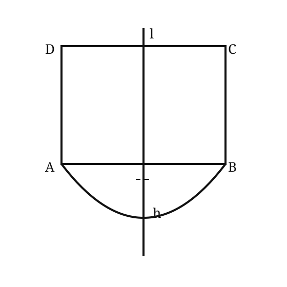

# 2002 年全国硕士研究生招生考试数学二真题

> 题面按用户提供的 1998–2007 历年真题合订 PDF 第 20–22 页逐题整理。第 7 题闸门图形依据原卷示意复绘。

## 一、填空题

### 第 1 题

设函数

$$
f(x)=
\begin{cases}
\displaystyle\frac{1-e^{\tan x}}{\arcsin(x/2)},&x>0,\\[8pt]
ae^{2x},&x\le0
\end{cases}
$$

在 $x=0$ 处连续，则 $a=$ ________。

### 第 2 题

位于曲线

$$
y=xe^{-x}\qquad(0\le x<+\infty)
$$

下方、$x$ 轴上方的无界图形的面积为 ________。

### 第 3 题

微分方程

$$
yy''+y'^2=0
$$

满足初始条件

$$
y|_{x=0}=1,
\qquad
y'|_{x=0}=\frac12
$$

的特解是 ________。

### 第 4 题

$$
\lim_{n\to\infty}
\frac1n
\left[
\sqrt{1+\cos\frac\pi n}
+
\sqrt{1+\cos\frac{2\pi}n}
+\cdots+
\sqrt{1+\cos\frac{n\pi}n}
\right]
=
\underline{\qquad\qquad}.
$$

### 第 5 题

矩阵

$$
\begin{pmatrix}
0&-2&-2\\
2&2&-2\\
-2&-2&2
\end{pmatrix}
$$

的非零特征值是 ________。

## 二、单项选择题

### 第 1 题

函数 $f(u)$ 可导，$y=f(x^2)$。当自变量 $x$ 在 $x=-1$ 处取得增量 $\Delta x=-0.1$ 时，相应的函数增量 $\Delta y$ 的线性主部为 $0.1$，则 $f'(1)=$（ ）。

A. $-1$

B. $0.1$

C. $1$

D. $0.5$

### 第 2 题

函数 $f(x)$ 连续，则下列函数中，必为偶函数的是（ ）。

A. $\displaystyle\int_0^x f(t^2)\,\mathrm dt$

B. $\displaystyle\int_0^x f^2(t)\,\mathrm dt$

C. $\displaystyle\int_0^x t[f(t)-f(-t)]\,\mathrm dt$

D. $\displaystyle\int_0^x t[f(t)+f(-t)]\,\mathrm dt$

### 第 3 题

设 $y=y(x)$ 是二阶常系数微分方程

$$
y''+py'+qy=e^{3x}
$$

满足初始条件

$$
y(0)=y'(0)=0
$$

的特解，则当 $x\to0$ 时，函数

$$
\frac{\ln(1+x^2)}{y(x)}
$$

的极限（ ）。

A. 不存在

B. 等于 $1$

C. 等于 $2$

D. 等于 $3$

### 第 4 题

设函数 $y=f(x)$ 在 $(0,+\infty)$ 内有界且可导，则（ ）。

A. 当 $\displaystyle\lim_{x\to+\infty}f'(x)=0$ 时，必有 $\displaystyle\lim_{x\to+\infty}f(x)=0$

B. 当 $\displaystyle\lim_{x\to+\infty}f'(x)$ 存在时，必有 $\displaystyle\lim_{x\to+\infty}f'(x)=0$

C. 当 $\displaystyle\lim_{x\to0^+}f(x)=0$ 时，必有 $\displaystyle\lim_{x\to0^+}f'(x)=0$

D. 当 $\displaystyle\lim_{x\to0^+}f'(x)$ 存在时，必有 $\displaystyle\lim_{x\to0^+}f'(x)=0$

### 第 5 题

设向量组 $\alpha_1,\alpha_2,\alpha_3$ 线性无关，向量 $\beta_1$ 可由 $\alpha_1,\alpha_2,\alpha_3$ 线性表示，而向量 $\beta_2$ 不能由 $\alpha_1,\alpha_2,\alpha_3$ 线性表示，则对于任意常数 $k$ 必有（ ）。

A. $\alpha_1,\alpha_2,\alpha_3,k\beta_1+\beta_2$ 线性无关

B. $\alpha_1,\alpha_2,\alpha_3,k\beta_1+\beta_2$ 线性相关

C. $\alpha_1,\alpha_2,\alpha_3,\beta_1+k\beta_2$ 线性无关

D. $\alpha_1,\alpha_2,\alpha_3,\beta_1+k\beta_2$ 线性相关

## 三、解答题

### 第 3 题（6 分）

已知曲线的极坐标方程为

$$
r=1-\cos\theta,
$$

求该曲线对应于

$$
\theta=\frac\pi6
$$

处的切线与法线的直角坐标方程。

### 第 4 题（7 分）

设

$$
f(x)=
\begin{cases}
2x+\dfrac32x^2,&-1\le x<0,\\[6pt]
\dfrac{xe^x}{(e^x+1)^2},&0\le x\le1.
\end{cases}
$$

求函数

$$
F(x)=\int_{-1}^x f(t)\,\mathrm dt
$$

的表达式。

### 第 5 题（7 分）

已知函数 $f(x)$ 在 $(0,+\infty)$ 内可导，$f(x)>0$，

$$
\lim_{x\to+\infty}f(x)=1,
$$

且满足

$$
\lim_{h\to0}
\left[
\frac{f(x+hx)}{f(x)}
\right]^{1/h}
=
e^{1/x},
$$

求 $f(x)$。

### 第 6 题（7 分）

求微分方程

$$
x\,\mathrm dy+(x-2y)\,\mathrm dx=0
$$

的一个解 $y=y(x)$，使得由曲线 $y=y(x)$ 与直线 $x=1$、$x=2$ 以及 $x$ 轴所围成的平面图形绕 $x$ 轴旋转一周的旋转体的体积最小。

### 第 7 题（7 分）

某闸门的形状与大小如图所示，其中直线 $l$ 为对称轴，闸门的上部为矩形 $ABCD$，下部由二次抛物线与线段 $AB$ 所围成。

当水面与闸门的上断相平时，欲使闸门矩形部分与承受的水压与闸门下部承受的水压之比为 $5:4$，问闸门矩形部分的高 $h$ 应为多少米？

### 第 8 题（8 分）

设

$$
0<x_1<3,
\qquad
x_{n+1}=\sqrt{x_n(3-x_n)}
\quad(n=1,2,\ldots).
$$

证明：数列 $\{x_n\}$ 的极限存在，并求此极限。

### 第 9 题（8 分）

设 $0<a<b$，证明不等式

$$
\frac{2a}{a^2+b^2}
<
\frac{\ln b-\ln a}{b-a}
<
\frac1{\sqrt{ab}}.
$$

### 第 10 题（8 分）

设函数 $f(x)$ 在 $x=0$ 的某邻域具有二阶连续导数，且

$$
f(0)\ne0,\qquad f'(0)\ne0,\qquad f''(0)\ne0.
$$

证明：存在唯一的一组实数 $\lambda_1,\lambda_2,\lambda_3$，使得当 $h\to0$ 时，

$$
\lambda_1f(h)+\lambda_2f(2h)+\lambda_3f(3h)-f(0)
$$

是比 $h^2$ 高阶的无穷小。

### 第 11 题（6 分）

已知 $A,B$ 为 $3$ 阶矩阵，且满足

$$
2A^{-1}B=B-4E,
$$

其中 $E$ 是 $3$ 阶单位矩阵。

（1）证明：矩阵 $A-2E$ 可逆；

（2）若

$$
B=
\begin{pmatrix}
1&-2&0\\
1&2&0\\
0&0&2
\end{pmatrix},
$$

求矩阵 $A$。

### 第 12 题（6 分）

已知 $4$ 阶方阵

$$
A=(\alpha_1,\alpha_2,\alpha_3,\alpha_4),
$$

$\alpha_1,\alpha_2,\alpha_3,\alpha_4$ 均为 $4$ 维列向量，其中 $\alpha_2,\alpha_3,\alpha_4$ 线性无关，

$$
\alpha_1=2\alpha_2-\alpha_3.
$$

若

$$
\beta=\alpha_1+\alpha_2+\alpha_3+\alpha_4,
$$

求线性方程组

$$
Ax=\beta
$$

的通解。
