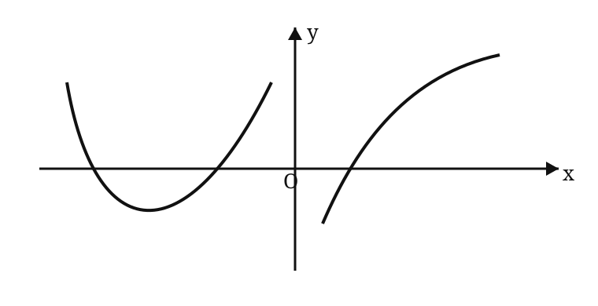

# 2003 年全国硕士研究生招生考试数学二真题

> 题面按用户提供的 1998–2007 历年真题合订 PDF 第 16–19 页逐题整理。选择题第 4 题图形依据原卷示意复绘。

## 一、填空题

### 第 1 题

若 $x\to0$ 时，

$$
(1-ax^2)^{1/4}-1
$$

与 $x\sin x$ 是等价无穷小，则 $a=$ ________。

### 第 2 题

设函数 $y=f(x)$ 由方程

$$
xy+2\ln x=y^4
$$

所确定，则曲线 $y=f(x)$ 在点 $(1,1)$ 处的切线方程是 ________。

### 第 3 题

$y=2^x$ 的麦克劳林公式中 $x^n$ 项的系数是 ________。

### 第 4 题

设曲线的极坐标方程为

$$
\rho=e^{a\theta}\qquad(a>0),
$$

则该曲线上相应于 $\theta$ 从 $0$ 变到 $2\pi$ 的一段弧与极轴所围成的图形的面积为 ________。

### 第 5 题

设 $\alpha$ 为 $3$ 维列向量，$\alpha^T$ 是 $\alpha$ 的转置。若

$$
\alpha\alpha^T=
\begin{pmatrix}
1&-1&1\\
-1&1&-1\\
1&-1&1
\end{pmatrix},
$$

则 $\alpha^T\alpha=$ ________。

### 第 6 题

设 $3$ 阶方阵 $A,B$ 满足

$$
A^2B-A-B=E,
$$

其中 $E$ 为 $3$ 阶单位矩阵。若

$$
A=
\begin{pmatrix}
1&0&1\\
0&2&0\\
-2&0&1
\end{pmatrix},
$$

则 $|B|=$ ________。

## 二、选择题

### 第 1 题

设 $\{a_n\},\{b_n\},\{c_n\}$ 均为非负数列，且

$$
\lim_{n\to\infty}a_n=0,
\qquad
\lim_{n\to\infty}b_n=1,
\qquad
\lim_{n\to\infty}c_n=\infty,
$$

则必有（ ）。

A. $a_n<b_n$ 对任意 $n$ 成立

B. $b_n<c_n$ 对任意 $n$ 成立

C. 极限 $\displaystyle\lim_{n\to\infty}a_nc_n$ 不存在

D. 极限 $\displaystyle\lim_{n\to\infty}b_nc_n$ 不存在

### 第 2 题

设

$$
a_n=\frac32\int_0^{n/(n+1)}x^{n-1}\sqrt{1+x^n}\,\mathrm dx,
$$

则极限 $\displaystyle\lim_{n\to\infty}na_n$ 等于（ ）。

A. $(1+e)^{3/2}+1$

B. $(1+e^{-1})^{3/2}-1$

C. $(1+e^{-1})^{3/2}+1$

D. $(1+e)^{3/2}-1$

### 第 3 题

已知

$$
y=\frac{x}{\ln x}
$$

是微分方程

$$
y'=\frac yx+\varphi\left(\frac xy\right)
$$

的解，则 $\varphi\left(\dfrac xy\right)$ 的表达式为（ ）。

A. $-\dfrac{y^2}{x^2}$

B. $\dfrac{y^2}{x^2}$

C. $-\dfrac{x^2}{y^2}$

D. $\dfrac{x^2}{y^2}$

### 第 4 题

设函数 $f(x)$ 在 $(-\infty,+\infty)$ 内连续，其导函数的图形如图所示，则 $f(x)$ 有（ ）。

A. 一个极小值点和两个极大值点

B. 两个极小值点和一个极大值点

C. 两个极小值点和两个极大值点

D. 一个极小值点和一个极大值点

### 第 5 题

设

$$
I_1=\int_0^{\pi/4}\frac{\tan x}{x}\,\mathrm dx,
\qquad
I_2=\int_0^{\pi/4}\frac{x}{\tan x}\,\mathrm dx,
$$

则（ ）。

A. $I_1>I_2>1$

B. $1>I_1>I_2$

C. $I_2>I_1>1$

D. $1>I_2>I_1$

### 第 6 题

设向量组 I：

$$
\alpha_1,\alpha_2,\ldots,\alpha_r
$$

可由向量组 II：

$$
\beta_1,\beta_2,\ldots,\beta_s
$$

线性表示，则（ ）。

A. 当 $r<s$ 时，向量组 II 必线性相关

B. 当 $r>s$ 时，向量组 II 必线性相关

C. 当 $r<s$ 时，向量组 I 必线性相关

D. 当 $r>s$ 时，向量组 I 必线性相关

## 三、解答题

### 第 3 题（10 分）

设函数

$$
f(x)=
\begin{cases}
\displaystyle\frac{\ln(1+ax^3)}{x-\arcsin x},&x<0,\\[8pt]
6,&x=0,\\[8pt]
\displaystyle\frac{e^{ax}+x^2-ax-1}{x\sin(x/4)},&x>0.
\end{cases}
$$

问：

（1）$a$ 为何值时，$f(x)$ 在 $x=0$ 处连续；

（2）$a$ 为何值时，$x=0$ 是 $f(x)$ 的可去间断点？

### 第 4 题（9 分）

设函数 $y=y(x)$ 由参数方程

$$
\begin{cases}
x=1+2t^2,\\[4pt]
y=\displaystyle\int_1^{1+2\ln t}\frac{e^u}{u}\,\mathrm du
\end{cases}
\qquad(t>1)
$$

所确定，求

$$
\left.\frac{\mathrm d^2y}{\mathrm dx^2}\right|_{x=9}.
$$

### 第 5 题（9 分）

计算不定积分

$$
\int\frac{xe^{\arctan x}}{(1+x^2)^{3/2}}\,\mathrm dx.
$$

### 第 6 题（12 分）

设函数 $y=y(x)$ 在 $(-\infty,+\infty)$ 内具有二阶导数，且 $y'\ne0$，$x=x(y)$ 是 $y=y(x)$ 的反函数。

（1）试将 $x=x(y)$ 所满足的微分方程

$$
\frac{\mathrm d^2x}{\mathrm dy^2}
+
(y+\sin x)
\left(\frac{\mathrm dx}{\mathrm dy}\right)^3
=0
$$

变换为 $y=y(x)$ 满足的微分方程；

（2）求变换后的微分方程满足初始条件

$$
y(0)=0,
\qquad
y'(0)=\frac32
$$

的解。

### 第 7 题（12 分）

讨论曲线

$$
y=4\ln x+k
$$

与

$$
y=4x+\ln^4x
$$

的交点个数。

### 第 8 题（12 分）

设位于第一象限的曲线 $y=f(x)$ 过点

$$
\left(\frac{\sqrt2}{2},\frac12\right),
$$

其上任一点 $P(x,y)$ 处的法线与 $y$ 轴的交点为 $Q$，且线段 $PQ$ 被 $x$ 轴平分。

（A）求曲线 $y=f(x)$ 的方程；

（B）已知曲线 $y=\sin x$ 在 $[0,\pi]$ 上的弧长为 $l$，试用 $l$ 表示曲线 $y=f(x)$ 的弧长 $s$。

### 第 9 题（10 分）

有一平底容器，其内侧壁是由曲线

$$
x=\varphi(y)\qquad(y\ge0)
$$

绕 $y$ 轴旋转而成的旋转曲面，容器的底面圆的半径为 $2\,\mathrm m$。

根据设计要求，当以 $3\,\mathrm{m^3/min}$ 的速率向容器内注入液体时，液面的面积将以 $\pi\,\mathrm{m^2/min}$ 的速率均匀扩大（假设注入液体前，容器内无液体）。

（1）根据 $t$ 时刻液面的面积，写出 $t$ 与 $\varphi(y)$ 之间的关系式；

（2）求曲线 $x=\varphi(y)$ 的方程。

### 第 10 题（10 分）

设函数 $f(x)$ 在闭区间 $[a,b]$ 上连续，在开区间 $(a,b)$ 内可导，且 $f'(x)>0$。若极限

$$
\lim_{x\to a^+}\frac{f(2x-a)}{x-a}
$$

存在，证明：

（1）在 $(a,b)$ 内 $f(x)>0$；

（2）在 $(a,b)$ 内存在点 $\xi$，使

$$
\frac{b^2-a^2}{\displaystyle\int_a^b f(x)\,\mathrm dx}
=
\frac{2\xi}{f(\xi)};
$$

（3）在 $(a,b)$ 内存在与（2）中 $\xi$ 相异的点 $\eta$，使

$$
f'(\eta)(b^2-a^2)
=
\frac{2\xi}{\xi-a}
\int_a^b f(x)\,\mathrm dx.
$$

### 第 11 题（10 分）

若矩阵

$$
A=
\begin{pmatrix}
2&2&0\\
8&2&a\\
0&0&6
\end{pmatrix}
$$

相似于对角阵 $\Lambda$，试确定常数 $a$ 的值，并求可逆矩阵 $P$，使

$$
P^{-1}AP=\Lambda.
$$

### 第 12 题（8 分）

已知平面上三条不同直线的方程分别为

$$
l_1:\ ax+2by+3c=0,
$$

$$
l_2:\ bx+2cy+3a=0,
$$

$$
l_3:\ cx+2ay+3b=0.
$$

试证这三条直线交于一点的充分必要条件为

$$
a+b+c=0.
$$
