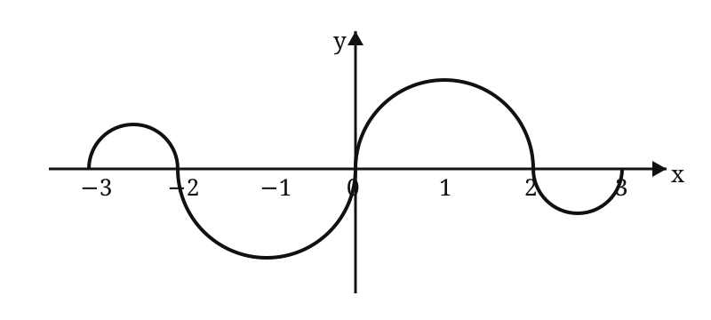

# 2007 年全国硕士研究生招生考试数学二真题

> 题面按用户提供的 1998–2007 历年真题合订 PDF 第 1–4 页逐题整理。第 3 题图形依据原卷示意复绘；若图形细节有疑义，以原卷扫描页为准。

## 一、选择题

### 第 1 题

当 $x\to0^+$ 时，与 $\sqrt{x}$ 等价的无穷小量是（ ）。

A. $1-e^{\sqrt{x}}$

B. $\displaystyle\ln\frac{1+x}{1-\sqrt{x}}$

C. $\sqrt{1+\sqrt{x}}-1$

D. $1-\cos\sqrt{x}$

### 第 2 题

函数

$$
f(x)=\frac{(e^{1/x}+e)\tan x}{x(e^{1/x}-e)}
$$

在 $[-\pi,\pi]$ 上的第一类间断点是 $x=$（ ）。

A. $0$

B. $1$

C. $-\dfrac{\pi}{2}$

D. $\dfrac{\pi}{2}$

### 第 3 题

如图，连续函数 $y=f(x)$ 在区间 $[-3,-2]$、$[2,3]$ 上的图形分别是直径为 $1$ 的上、下半圆周，在区间 $[-2,0]$、$[0,2]$ 上的图形分别是直径为 $2$ 的下、上半圆周。设

$$
F(x)=\int_0^x f(t)\,\mathrm dt,
$$

则下列结论正确的是（ ）。

A. $F(3)=-\dfrac34F(-2)$

B. $F(3)=\dfrac54F(2)$

C. $F(-3)=\dfrac34F(2)$

D. $F(-3)=\dfrac54F(-2)$

### 第 4 题

设函数 $f(x)$ 在 $x=0$ 处连续，下列命题错误的是（ ）。

A. 若 $\displaystyle\lim_{x\to0}\frac{f(x)}x$ 存在，则 $f(0)=0$

B. 若 $\displaystyle\lim_{x\to0}\frac{f(x)+f(-x)}x$ 存在，则 $f(0)=0$

C. 若 $\displaystyle\lim_{x\to0}\frac{f(x)}x$ 存在，则 $f'(0)=0$

D. 若 $\displaystyle\lim_{x\to0}\frac{f(x)-f(-x)}x$ 存在，则 $f'(0)=0$

### 第 5 题

曲线

$$
y=\frac1x+\ln(1+e^x)
$$

渐近线的条数为（ ）。

A. $0$

B. $1$

C. $2$

D. $3$

### 第 6 题

设函数 $f(x)$ 在 $(0,+\infty)$ 上具有二阶导数，且 $f''(x)>0$，令

$$
u_n=f(n),\qquad n=1,2,\ldots
$$

则下列结论正确的是（ ）。

A. 若 $u_1>u_2$，则 $\{u_n\}$ 必收敛

B. 若 $u_1>u_2$，则 $\{u_n\}$ 必发散

C. 若 $u_1<u_2$，则 $\{u_n\}$ 必收敛

D. 若 $u_1<u_2$，则 $\{u_n\}$ 必发散

### 第 7 题

二元函数 $f(x,y)$ 在点 $(0,0)$ 处可微的一个充分条件是（ ）。

A. $\displaystyle\lim_{(x,y)\to(0,0)}[f(x,y)-f(0,0)]=0$

B. $\displaystyle\lim_{x\to0}\frac{f(x,0)-f(0,0)}x=0$，且 $\displaystyle\lim_{y\to0}\frac{f(0,y)-f(0,0)}y=0$

C. $\displaystyle\lim_{(x,y)\to(0,0)}\frac{f(x,y)-f(0,0)}{\sqrt{x^2+y^2}}=0$

D. $\displaystyle\lim_{x\to0}[f_x'(x,0)-f_x'(0,0)]=0$，且 $\displaystyle\lim_{y\to0}[f_y'(0,y)-f_y'(0,0)]=0$

### 第 8 题

设函数 $f(x,y)$ 连续，则二次积分

$$
\int_{\pi/2}^{\pi}\mathrm dx\int_{\sin x}^{1}f(x,y)\,\mathrm dy
$$

等于（ ）。

A. $\displaystyle\int_0^1\mathrm dy\int_{\pi+\arcsin y}^{\pi}f(x,y)\,\mathrm dx$

B. $\displaystyle\int_0^1\mathrm dy\int_{\pi-\arcsin y}^{\pi}f(x,y)\,\mathrm dx$

C. $\displaystyle\int_0^1\mathrm dy\int_{\pi/2}^{\pi+\arcsin y}f(x,y)\,\mathrm dx$

D. $\displaystyle\int_0^1\mathrm dy\int_{\pi/2}^{\pi-\arcsin y}f(x,y)\,\mathrm dx$

### 第 9 题

设向量组 $\alpha_1,\alpha_2,\alpha_3$ 线性无关，则下列向量组线性相关的是（ ）。

A. $\alpha_1-\alpha_2,\ \alpha_2-\alpha_3,\ \alpha_3-\alpha_1$

B. $\alpha_1+\alpha_2,\ \alpha_2+\alpha_3,\ \alpha_3+\alpha_1$

C. $\alpha_1-2\alpha_2,\ \alpha_2-2\alpha_3,\ \alpha_3-2\alpha_1$

D. $\alpha_1+2\alpha_2,\ \alpha_2+2\alpha_3,\ \alpha_3+2\alpha_1$

### 第 10 题

设矩阵

$$
A=
\begin{pmatrix}
2&-1&-1\\
-1&2&-1\\
-1&-1&2
\end{pmatrix},
\qquad
B=
\begin{pmatrix}
1&0&0\\
0&1&0\\
0&0&0
\end{pmatrix},
$$

则 $A$ 与 $B$（ ）。

A. 合同且相似

B. 合同，但不相似

C. 不合同，但相似

D. 既不合同也不相似

## 二、填空题

### 第 11 题

$$
\lim_{x\to0}\frac{\arctan x-\sin x}{x^3}
=
\underline{\qquad\qquad}.
$$

### 第 12 题

曲线

$$
\begin{cases}
x=\cos t+\cos^2t,\\
y=1+\sin t
\end{cases}
$$

上对应于 $t=\dfrac\pi4$ 的点处的法线斜率为 ________。

### 第 13 题

设函数

$$
y=\frac1{2x+3},
$$

则 $y^{(n)}(0)=$ ________。

### 第 14 题

二阶常系数非齐次微分方程

$$
y''-4y'+3y=2e^{2x}
$$

的通解为 $y=$ ________。

### 第 15 题

设 $f(u,v)$ 是二元可微函数，

$$
z=f\left(\frac yx,\frac xy\right),
$$

则

$$
x\frac{\partial z}{\partial x}
-
y\frac{\partial z}{\partial y}
=
\underline{\qquad\qquad}.
$$

### 第 16 题

设矩阵

$$
A=
\begin{pmatrix}
0&1&0&0\\
0&0&1&0\\
0&0&0&1\\
0&0&0&0
\end{pmatrix},
$$

则 $A^3$ 的秩为 ________。

## 三、解答题

### 第 17 题（10 分）

设 $f(x)$ 是区间 $\left[0,\dfrac\pi4\right]$ 上单调、可导的函数，且满足

$$
\int_0^{f(x)}f^{-1}(t)\,\mathrm dt
=
\int_0^x
t\frac{\cos t-\sin t}{\sin t+\cos t}\,\mathrm dt,
$$

其中 $f^{-1}$ 是 $f$ 的反函数，求 $f(x)$。

### 第 18 题（11 分）

设 $D$ 是位于曲线

$$
y=\sqrt{xa}\,e^{-x/(2a)}
\qquad(a>1,\ 0\le x<+\infty)
$$

下方、$x$ 轴上方的无界区域。

（I）求区域 $D$ 绕 $x$ 轴旋转一周所成旋转体的体积 $V(a)$；

（II）当 $a$ 为何值时，$V(a)$ 最小？并求此最小值。

### 第 19 题（10 分）

求微分方程

$$
y''(x+y'^2)=y'
$$

满足初始条件

$$
y(1)=y'(1)=1
$$

的特解。

### 第 20 题（11 分）

已知函数 $f(u)$ 具有二阶导数，且 $f'(0)=1$，函数 $y=y(x)$ 由方程

$$
y-xe^{y-1}=1
$$

所确定。设

$$
z=f(\ln y-\sin x),
$$

求

$$
\left.\frac{\mathrm dz}{\mathrm dx}\right|_{x=0},
\qquad
\left.\frac{\mathrm d^2z}{\mathrm dx^2}\right|_{x=0}.
$$

### 第 21 题（11 分）

设函数 $f(x),g(x)$ 在 $[a,b]$ 上连续，在 $(a,b)$ 内具有二阶导数且存在相等的最大值，

$$
f(a)=g(a),\qquad f(b)=g(b).
$$

证明：存在 $\xi\in(a,b)$，使得

$$
f''(\xi)=g''(\xi).
$$

### 第 22 题（11 分）

设二元函数

$$
f(x,y)=
\begin{cases}
x^2,& |x|+|y|\le1,\\[4pt]
\dfrac1{\sqrt{x^2+y^2}},&1<|x|+|y|\le2,
\end{cases}
$$

计算二重积分

$$
\iint_D f(x,y)\,\mathrm d\sigma,
$$

其中

$$
D=\{(x,y)\mid |x|+|y|\le2\}.
$$

### 第 23 题（11 分）

设线性方程组

$$
\begin{cases}
x_1+x_2+x_3=0,\\
x_1+2x_2+ax_3=0,\\
x_1+4x_2+a^2x_3=0
\end{cases}
$$

与方程

$$
x_1+2x_2+x_3=a-1
$$

有公共解，求 $a$ 的值及所有公共解。

### 第 24 题（11 分）

设 $3$ 阶对称矩阵 $A$ 的特征值

$$
\lambda_1=1,\qquad\lambda_2=2,\qquad\lambda_3=-2,
$$

$\alpha_1=(1,-1,1)^T$ 是 $A$ 的属于 $\lambda_1$ 的一个特征向量，记

$$
B=A^5-4A^3+E,
$$

其中 $E$ 为 $3$ 阶单位矩阵。

（I）验证 $\alpha_1$ 是矩阵 $B$ 的特征向量，并求 $B$ 的全部特征值与特征向量；

（II）求矩阵 $B$。
