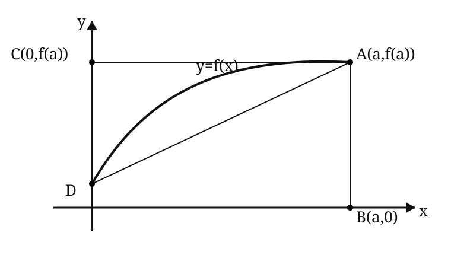
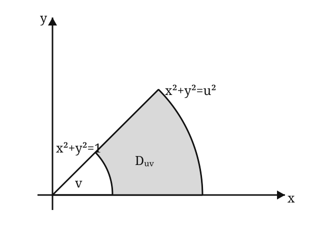

# 2008 年全国硕士研究生招生考试数学二真题

> 题面按用户提供的 2008–2017 历年真题合订 PDF 第 33–35 页逐题整理。第 2、6 题图形依据原卷示意复绘；若图形细节有疑义，以原卷扫描页为准。

## 一、选择题

### 第 1 题

设函数

$$
f(x)=x^2(x-1)(x-2),
$$

则 $f'(x)$ 的零点个数为（ ）。

A. $0$

B. $1$

C. $2$

D. $3$

### 第 2 题

曲线段的方程为 $y=f(x)$，函数 $f(x)$ 在区间 $[0,a]$ 上有连续导数，则定积分

$$
\int_0^a x f'(x)\,\mathrm dx
$$

等于（ ）。

A. 曲边梯形 $ABOD$ 面积

B. 梯形 $ABOD$ 面积

C. 曲边三角形 $ACD$ 面积

D. 三角形 $ACD$ 面积

### 第 3 题

在下列微分方程中，以

$$
y=C_1e^x+C_2\cos2x+C_3\sin2x
$$

（$C_1,C_2,C_3$ 为任意常数）为通解的是（ ）。

A. $y'''+y''-4y'-4y=0$

B. $y'''+y''+4y'+4y=0$

C. $y'''-y''-4y'+4y=0$

D. $y'''-y''+4y'-4y=0$

### 第 4 题

设函数

$$
f(x)=\frac{\ln|x|}{|x-1|}\sin x,
$$

则 $f(x)$ 有（ ）。

A. $1$ 个可去间断点，$1$ 个跳跃间断点

B. $1$ 个可去间断点，$1$ 个无穷间断点

C. $2$ 个跳跃间断点

D. $2$ 个无穷间断点

### 第 5 题

设函数 $f(x)$ 在 $(-\infty,+\infty)$ 内单调有界，$\{x_n\}$ 为数列，下列命题正确的是（ ）。

A. 若 $\{x_n\}$ 收敛，则 $\{f(x_n)\}$ 收敛

B. 若 $\{x_n\}$ 单调，则 $\{f(x_n)\}$ 收敛

C. 若 $\{f(x_n)\}$ 收敛，则 $\{x_n\}$ 收敛

D. 若 $\{f(x_n)\}$ 单调，则 $\{x_n\}$ 收敛

### 第 6 题

设函数 $f$ 连续，若

$$
F(u,v)=\iint_{D_{uv}}\frac{f(x^2+y^2)}{\sqrt{x^2+y^2}}\,\mathrm dx\,\mathrm dy,
$$

其中区域 $D_{uv}$ 为图中阴影部分，则

$$
\frac{\partial F}{\partial u}
=
\text{（ ）}.
$$

A. $vf(u^2)$

B. $\dfrac vu f(u^2)$

C. $vf(u)$

D. $\dfrac vu f(u)$

### 第 7 题

设 $A$ 为 $n$ 阶非零矩阵，$E$ 为 $n$ 阶单位矩阵。若 $A^3=O$，则（ ）。

A. $E-A$ 不可逆，$E+A$ 不可逆

B. $E-A$ 不可逆，$E+A$ 可逆

C. $E-A$ 可逆，$E+A$ 可逆

D. $E-A$ 可逆，$E+A$ 不可逆

### 第 8 题

设

$$
A=
\begin{pmatrix}
1&2\\
2&1
\end{pmatrix},
$$

则在实数域上与 $A$ 合同的矩阵为（ ）。

A. $\displaystyle\begin{pmatrix}-2&1\\1&-2\end{pmatrix}$

B. $\displaystyle\begin{pmatrix}2&-1\\-1&2\end{pmatrix}$

C. $\displaystyle\begin{pmatrix}2&1\\1&2\end{pmatrix}$

D. $\displaystyle\begin{pmatrix}1&-2\\-2&1\end{pmatrix}$

## 二、填空题

### 第 9 题

已知函数 $f(x)$ 连续，且

$$
\lim_{x\to0}
\frac{1-\cos[xf(x)]}{(e^{x^2}-1)f(x)}
=1,
$$

则 $f(0)=$ ________。

### 第 10 题

微分方程

$$
(y+x^2e^{-x})\,\mathrm dx-x\,\mathrm dy=0
$$

的通解是 $y=$ ________。

### 第 11 题

曲线

$$
\sin(xy)+\ln(y-x)=x
$$

在点 $(0,1)$ 处的切线方程为 ________。

### 第 12 题

曲线

$$
y=(x-5)x^{2/3}
$$

的拐点坐标为 ________。

### 第 13 题

设

$$
z=\left(\frac yx\right)^{x/y},
$$

则

$$
\left.\frac{\partial z}{\partial x}\right|_{(1,2)}
=
\text{________}.
$$

### 第 14 题

设 $3$ 阶矩阵 $A$ 的特征值为 $2,3,\lambda$。若行列式 $|2A|=-48$，则 $\lambda=$ ________。

## 三、解答题

### 第 15 题（9 分）

求极限

$$
\lim_{x\to0}
\frac{[\sin x-\sin(\sin x)]\sin x}{x^4}.
$$

### 第 16 题（10 分）

设函数 $y=y(x)$ 由参数方程

$$
\begin{cases}
x=x(t),\\[4pt]
y=\displaystyle\int_0^{t^2}\ln(1+u)\,\mathrm du
\end{cases}
$$

确定，其中 $x(t)$ 是初值问题

$$
\begin{cases}
\dfrac{\mathrm dx}{\mathrm dt}-2te^{-x}=0,\\[6pt]
x|_{t=0}=0
\end{cases}
$$

的解。求

$$
\frac{\mathrm d^2y}{\mathrm dx^2}.
$$

### 第 17 题（9 分）

求积分

$$
\int_0^1\frac{x^2\arcsin x}{\sqrt{1-x^2}}\,\mathrm dx.
$$

### 第 18 题（11 分）

求二重积分

$$
\iint_D\max(xy,1)\,\mathrm dx\,\mathrm dy,
$$

其中

$$
D=\{(x,y)\mid0\le x\le2,\ 0\le y\le2\}.
$$

### 第 19 题（11 分）

设 $f(x)$ 是区间 $[0,+\infty)$ 上具有连续导数的单调增加函数，且 $f(0)=1$。对任意 $t\in[0,+\infty)$，直线 $x=0$、$x=t$，曲线 $y=f(x)$ 以及 $x$ 轴所围成的曲边梯形绕 $x$ 轴旋转一周生成一旋转体。

若该旋转体的侧面积在数值上等于其体积的 $2$ 倍，求函数 $f(x)$ 的表达式。

### 第 20 题（11 分）

（1）证明积分中值定理：若函数 $f(x)$ 在闭区间 $[a,b]$ 上连续，则至少存在一点 $\eta\in[a,b]$，使得

$$
\int_a^b f(x)\,\mathrm dx=f(\eta)(b-a).
$$

（2）若函数 $\varphi(x)$ 具有二阶导数，且满足

$$
\varphi(2)>\varphi(1),
\qquad
\varphi(2)>\int_1^3\varphi(x)\,\mathrm dx,
$$

证明：至少存在一点 $\xi\in(1,3)$，使得

$$
\varphi''(\xi)<0.
$$

### 第 21 题（11 分）

求函数

$$
u=x^2+y^2+z^2
$$

在约束条件

$$
z=x^2+y^2,
\qquad
x+y+z=4
$$

下的最大值与最小值。

### 第 22 题（12 分）

设 $n$ 元线性方程组 $Ax=b$，其中

$$
A=
\begin{pmatrix}
2a&1&&&\\
a^2&2a&1&&\\
&\ddots&\ddots&\ddots&\\
&&a^2&2a&1\\
&&&a^2&2a
\end{pmatrix}_{n\times n},
\qquad
x=
\begin{pmatrix}
x_1\\x_2\\\vdots\\x_n
\end{pmatrix},
\qquad
b=
\begin{pmatrix}
1\\0\\\vdots\\0
\end{pmatrix}.
$$

（1）证明行列式

$$
|A|=(n+1)a^n;
$$

（2）$a$ 为何值时，该方程组有唯一解，并求 $x_1$；

（3）$a$ 为何值时，该方程组有无穷多解，并求通解。

### 第 23 题（10 分）

设 $A$ 为 $3$ 阶矩阵，$\alpha_1,\alpha_2$ 为 $A$ 的分别属于特征值 $-1,1$ 的特征向量，向量 $\alpha_3$ 满足

$$
A\alpha_3=\alpha_2+\alpha_3.
$$

（1）证明 $\alpha_1,\alpha_2,\alpha_3$ 线性无关；

（2）令

$$
P=(\alpha_1,\alpha_2,\alpha_3),
$$

求 $P^{-1}AP$。
