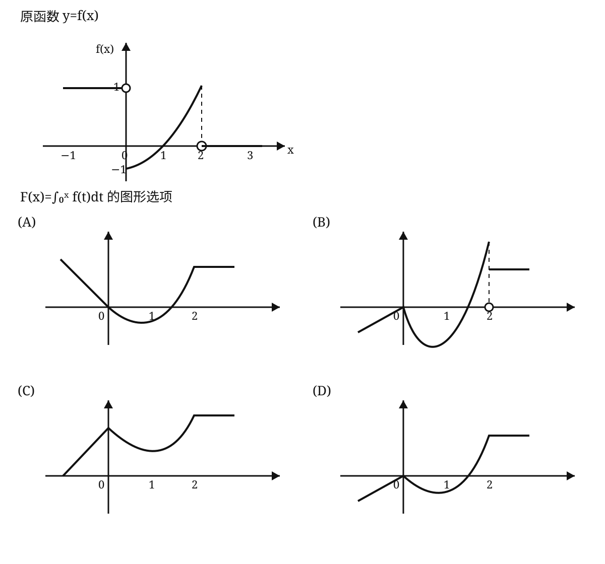

# 2009 年全国硕士研究生招生考试数学二真题

> 题面按用户提供的 2008–2017 历年真题合订 PDF 逐页整理；公式、矩阵与第 6 题图形已按原卷重新排版。第 6 题图为依据原卷示意复绘，若图形细节有疑义，以原卷扫描页为准。

## 一、选择题

<!-- source: 考研数学历年真题(2008-2017)年数学二.pdf; PDF 第 29 页 -->

### 第 1 题

函数

$$
f(x)=\frac{x-x^3}{\sin \pi x}
$$

的可去间断点的个数为（ ）。

A. $1$

B. $2$

C. $3$

D. 无穷多个

### 第 2 题

当 $x\to0$ 时，$f(x)=x-\sin ax$ 与 $g(x)=x^2\ln(1-bx)$ 是等价无穷小，则（ ）。

A. $a=1,\ b=-\dfrac16$

B. $a=1,\ b=\dfrac16$

C. $a=-1,\ b=-\dfrac16$

D. $a=-1,\ b=\dfrac16$

### 第 3 题

设函数 $z=f(x,y)$ 的全微分为

$$
\mathrm dz=x\,\mathrm dx+y\,\mathrm dy,
$$

则点 $(0,0)$（ ）。

A. 不是 $f(x,y)$ 的连续点

B. 不是 $f(x,y)$ 的极值点

C. 是 $f(x,y)$ 的极大值点

D. 是 $f(x,y)$ 的极小值点

### 第 4 题

设函数 $f(x,y)$ 连续，则

$$
\int_1^2\mathrm dx\int_x^2 f(x,y)\,\mathrm dy
+
\int_1^2\mathrm dy\int_y^{4-y}f(x,y)\,\mathrm dx
=
\text{（ ）}.
$$

A. $\displaystyle\int_1^2\mathrm dx\int_x^{4-x}f(x,y)\,\mathrm dy$

B. $\displaystyle\int_1^2\mathrm dx\int_0^{4-x}f(x,y)\,\mathrm dy$

C. $\displaystyle\int_1^2\mathrm dy\int_1^{4-y}f(x,y)\,\mathrm dx$

D. $\displaystyle\int_1^2\mathrm dy\int_y^2f(x,y)\,\mathrm dx$

### 第 5 题

若 $f''(x)$ 不变号，且曲线 $y=f(x)$ 在点 $(1,1)$ 处的曲率圆为

$$
x^2+y^2=2,
$$

则 $f(x)$ 在区间 $(1,2)$ 内（ ）。

A. 有极值点，无零点

B. 无极值点，有零点

C. 有极值点，有零点

D. 无极值点，无零点

### 第 6 题

设函数 $y=f(x)$ 在区间 $[-1,3]$ 上的图形如图所示，则函数

$$
F(x)=\int_0^x f(t)\,\mathrm dt
$$

的图形为（ ）。

<!-- source: 考研数学历年真题(2008-2017)年数学二.pdf; PDF 第 30 页 -->

### 第 7 题

设 $A,B$ 均为 $2$ 阶矩阵，$A^*,B^*$ 分别为 $A,B$ 的伴随矩阵。若 $|A|=2,\ |B|=3$，则分块矩阵

$$
\begin{pmatrix}
0&A\\
B&0
\end{pmatrix}
$$

的伴随矩阵为（ ）。

A. $\displaystyle\begin{pmatrix}0&3B^*\\2A^*&0\end{pmatrix}$

B. $\displaystyle\begin{pmatrix}0&2B^*\\3A^*&0\end{pmatrix}$

C. $\displaystyle\begin{pmatrix}0&3A^*\\2B^*&0\end{pmatrix}$

D. $\displaystyle\begin{pmatrix}0&2A^*\\3B^*&0\end{pmatrix}$

### 第 8 题

设 $A,P$ 均为 $3$ 阶矩阵，$P^T$ 为 $P$ 的转置矩阵，且

$$
P^TAP=
\begin{pmatrix}
1&0&0\\
0&1&0\\
0&0&2
\end{pmatrix}.
$$

若 $P=(\alpha_1,\alpha_2,\alpha_3)$，$Q=(\alpha_1+\alpha_2,\alpha_2,\alpha_3)$，则 $Q^TAQ$ 为（ ）。

A. $\displaystyle\begin{pmatrix}2&1&0\\1&1&0\\0&0&2\end{pmatrix}$

B. $\displaystyle\begin{pmatrix}1&1&0\\1&2&0\\0&0&2\end{pmatrix}$

C. $\displaystyle\begin{pmatrix}2&0&0\\0&1&0\\0&0&2\end{pmatrix}$

D. $\displaystyle\begin{pmatrix}1&0&0\\0&2&0\\0&0&2\end{pmatrix}$

## 二、填空题

<!-- source: 考研数学历年真题(2008-2017)年数学二.pdf; PDF 第 31 页 -->

### 第 9 题

曲线

$$
\begin{cases}
x=\displaystyle\int_0^{1-t}e^{-u^2}\,\mathrm du,\\[6pt]
y=t^2\ln(2-t^2)
\end{cases}
$$

在 $(0,0)$ 处的切线方程为 ________。

### 第 10 题

已知

$$
\int_{-\infty}^{+\infty}e^{k|x|}\,\mathrm dx=1,
$$

则 $k=$ ________。

### 第 11 题

$$
\lim_{n\to\infty}\int_0^1 e^{-x}\sin nx\,\mathrm dx
=
\underline{\qquad\qquad}.
$$

### 第 12 题

设 $y=y(x)$ 是由方程

$$
xy+e^y=x+1
$$

确定的隐函数，则

$$
\left.\frac{\mathrm d^2y}{\mathrm dx^2}\right|_{x=0}
=
\underline{\qquad\qquad}.
$$

### 第 13 题

函数

$$
y=x^{2x}
$$

在区间 $(0,1]$ 上的最小值为 ________。

### 第 14 题

设 $\alpha,\beta$ 为 $3$ 维列向量，$\beta^T$ 为 $\beta$ 的转置。若矩阵 $\alpha\beta^T$ 相似于

$$
\begin{pmatrix}
2&0&0\\
0&0&0\\
0&0&0
\end{pmatrix},
$$

则 $\beta^T\alpha=$ ________。

## 三、解答题

### 第 15 题（9 分）

求极限

$$
\lim_{x\to0}
\frac{(1-\cos x)\,[x-\ln(1+\tan x)]}{\sin^4x}.
$$

### 第 16 题（10 分）

计算不定积分

$$
\int \ln\left(1+\sqrt{\frac{1+x}{x}}\right)\,\mathrm dx,
\qquad x>0.
$$

### 第 17 题（10 分）

设

$$
z=f(x+y,x-y,xy),
$$

其中 $f$ 具有二阶连续偏导数，求 $\mathrm dz$ 与

$$
\frac{\partial^2 z}{\partial x\partial y}.
$$

### 第 18 题（10 分）

设非负函数 $y=y(x)\ (x\ge0)$ 满足微分方程

$$
xy''-y'+2=0.
$$

当曲线 $y=y(x)$ 过原点时，其与直线 $x=1$ 及 $y=0$ 围成平面区域 $D$ 的面积为 $2$，求 $D$ 绕 $y$ 轴旋转所得旋转体体积。

<!-- source: 考研数学历年真题(2008-2017)年数学二.pdf; PDF 第 32 页 -->

### 第 19 题（10 分）

计算二重积分

$$
\iint_D(x-y)\,\mathrm dx\,\mathrm dy,
$$

其中

$$
D=\left\{(x,y)\mid (x-1)^2+(y-1)^2\le2,\ y\ge x\right\}.
$$

### 第 20 题（12 分）

设 $y=y(x)$ 是区间 $(-\pi,\pi)$ 内过点

$$
\left(-\frac{\pi}{\sqrt2},\frac{\pi}{\sqrt2}\right)
$$

的光滑曲线。当 $-\pi<x<0$ 时，曲线上任一点处的法线都过原点；当 $0\le x<\pi$ 时，函数 $y(x)$ 满足

$$
y''+y+x=0.
$$

求 $y(x)$ 的表达式。

### 第 21 题（11 分）

（I）证明拉格朗日中值定理：若函数 $f(x)$ 在 $[a,b]$ 上连续，在 $(a,b)$ 内可导，则存在点 $\xi\in(a,b)$，使得

$$
f(b)-f(a)=f'(\xi)(b-a).
$$

（II）证明：若函数 $f(x)$ 在 $x=0$ 处连续，在 $(0,\delta)\ (\delta>0)$ 内可导，且

$$
\lim_{x\to0^+}f'(x)=A,
$$

则 $f'_+(0)$ 存在，且 $f'_+(0)=A$。

### 第 22 题（11 分）

设

$$
A=
\begin{pmatrix}
1&-1&-1\\
-1&1&1\\
0&-4&-2
\end{pmatrix},
\qquad
\xi_1=
\begin{pmatrix}
-1\\
1\\
-2
\end{pmatrix}.
$$

（I）求满足

$$
A\xi_2=\xi_1,\qquad A^2\xi_3=\xi_1
$$

的所有向量 $\xi_2,\xi_3$。

（II）对（I）中的任一向量 $\xi_2,\xi_3$，证明：$\xi_1,\xi_2,\xi_3$ 线性无关。

### 第 23 题（11 分）

设二次型

$$
f(x_1,x_2,x_3)
=
ax_1^2+ax_2^2+(a-1)x_3^2+2x_1x_3-2x_2x_3.
$$

（I）求二次型 $f$ 的矩阵的所有特征值；

（II）若二次型 $f$ 的规范形为

$$
y_1^2+y_2^2,
$$

求 $a$ 的值。
